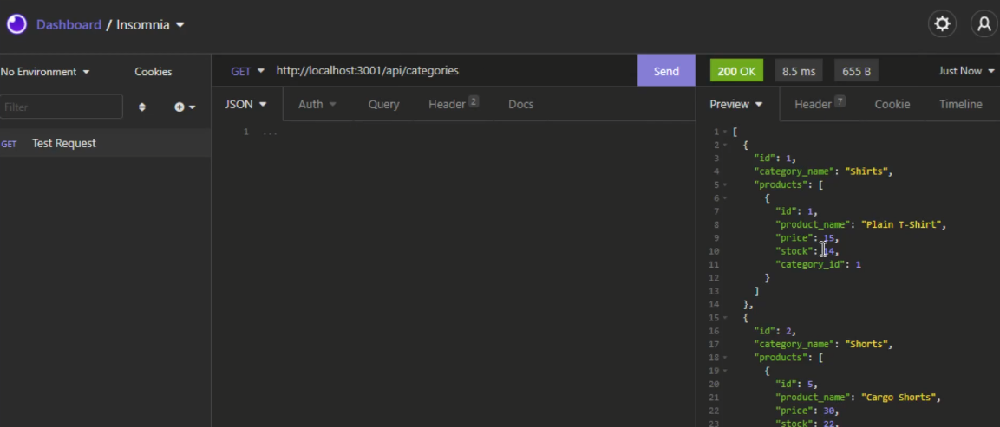
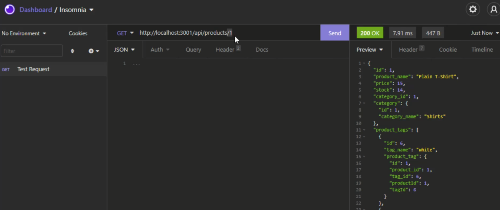
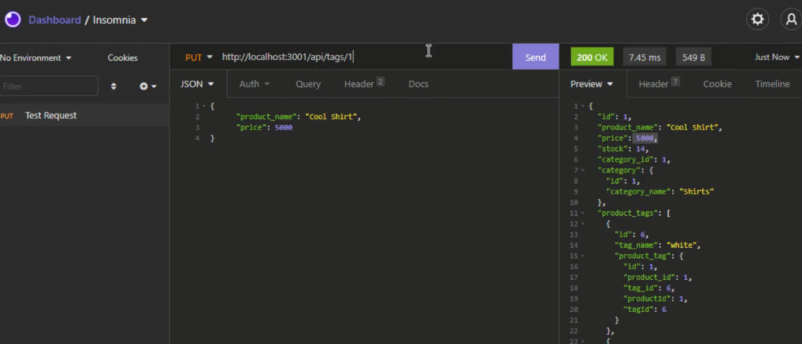
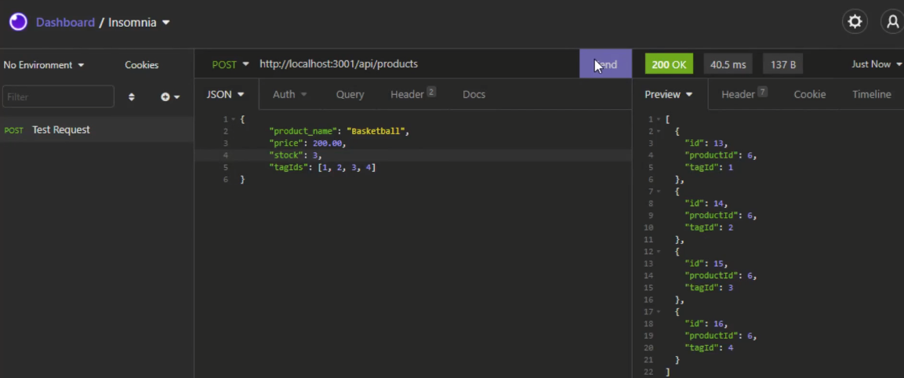

# e-commerce-back-end [](https://opensource.org/licenses/MIT)

## Table of Contents
* [Description](#description)
* [Installation](#installation)
* [Usage](#usage)
* [License](#license)
* [How to Contribute](#how-to-contribute)
* [Contact](#contact)

## Description
An e-commerce back-end using an Express.js server and using Sequelize to connect with a MySQL database. It was my first time using Sequelize to interact with MySQL, so I learned a lot from building this back-end.

## Installation
Navigate to ```./e-commerce-back-end```

Run the following command from the terminal: 

```npm i```

## Usage
1. Ensure MySQL is installed and set up on your computer before using this application. A guide can be found [here](https://dev.mysql.com/doc/mysql-installation-excerpt/5.7/en/)

2. Navigate to ```./e-commerce-back-end```

3. Initialise the database by running the following commands in the terminal: 
```mysql -u root -p```
```source db/schema.sql```

4. Open a new terminal and run the following commands:
```npm run seed```
```npm start```

Click the image below for a tutorial video:

[](https://watch.screencastify.com/v/5s305XdIypLIeSfBGXx2)

Screenshots:





## License 
This project is covered under the MIT License: [](https://opensource.org/licenses/MIT)

## How to Contribute
Fork the repository or contact me using the details shown below

## Contact
Please feel free to contact me through GitHub or email, using the following details: 

Email: mel.jack.developer@gmail.com

GitHub: [meljack1](https://github.com/meljack1/)
